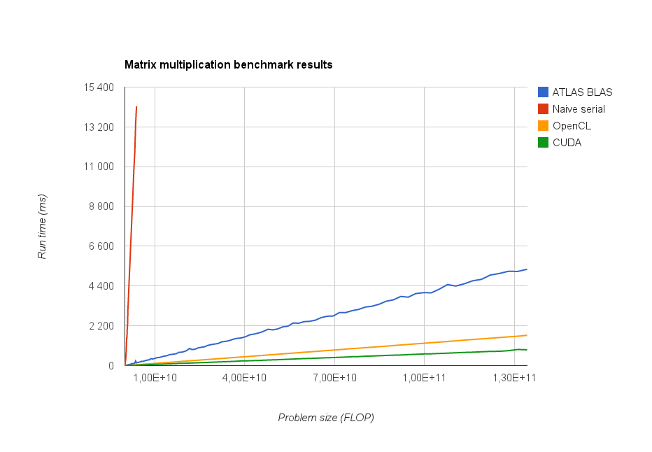

Comparison of CUDA and OpenCL
=============================

This document is written as an investigation of the differences between using CUDA or OpenCL to write GPGPU application. The investigation focuses on the differences in performance and ease of use. Finally, CUDA is recommended as a basis for further development.

Performance comparison
----------------------

In order to compare the performance differences between CUDA and OpenCL, a simple matrix multiplication algorithm was implemented in both CUDA and OpenCL. These implementations where based on examples provided by NVIDIA and AMD. In order to establish a baseline, to which the CUDA and OpenCL results could be compared, additional implementations of the matrix multiplication algorithm was made, as both a naive serial implementation in C and a highly optimized implementation using the Automatically Tuned Linear Algebra Software ([ATLAS](http://math-atlas.sourceforge.net/)) implementation of BLAS.

The test algorithm multiplies two square matrices of size NxN. This is an interesting problem to use for performance benchmarking for a number of reasons:

* Matrix multiplication is often used as a subroutine in more advanced mathematical algorithms.
* Matrix multiplication can be parallelized over a large number of computational cores, making it suitable for GPGPU programming.
* The mathematics of matrix multiplication is trivial, making it an easy to understand example problem.

The four implementations where tested on a desktop computer running 64-bit Ubuntu 13.04 with the following hardware:

| Type       | Hardware                              |
|------------|---------------------------------------|
| Processor  | Intel Core i7-2600K CPU @ 3.40GHz x 8 |
| Graphics   | GeForce GTX 560 Ti/PCIe/SSE2          |
| Memory     | 7.8 GiB                               |

The results are presented in the following graph:

We see that the naive serial implementation quickly becomes unusable, due to a rapid increase in run time. The improvement gained by using ATLAS BLAS is very large compared to the naive implementation, although it cannot keep up with the run times achieved by the CUDA and OpenCL implementations.

The difference between CUDA and OpenCL is quite small, compared to the other implementations, but the CUDA implementation is on average about twice as fast as the OpenCL implementation. This is quite a big difference, and this could be related to all tests being run on a NVIDIA graphics card. It might also have been caused by different quality between the NVIDIA and AMD examples.

It is also important to note that this is a very small test. In order to be able to conclude if CUDA is indeed faster than OpenCL, one would have needed to implement a wide selection of algorithms and test them on several different hardware configurations. Although this test is non conclusive regarding this question, the results seem to support several older investigations, concluding that CUDA is faster than OpenCL. One notable example being [A Comprehensive Performance Comparison of
CUDA and OpenCL](https://www.google.com/url?sa=t&rct=j&q=&esrc=s&source=web&cd=1&cad=rja&ved=0CC4QFjAA&url=http%3A%2F%2Fwww.researchgate.net%2Fpublication%2F224262957_A_Comprehensive_Performance_Comparison_of_CUDA_and_OpenCL%2Ffile%2F9c96051c2bd67d9896.pdf&ei=a17WUp3IAe2MyQPYtYHYCA&usg=AFQjCNFH4LaF52l3MCQh4a2M7l-EA0zvdA&sig2=oBxdSx4bOewMRbnzqrlARQ) by Janbin Fang et al.

Ease of use comparison
----------------------

* Documentation
* Installation
* Coding
