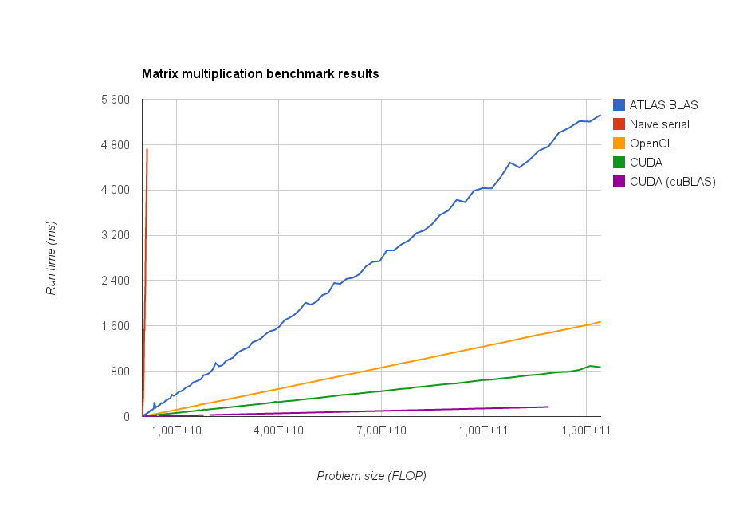

Comparison of CUDA and OpenCL
=============================

This document is written as an investigation of the differences between using CUDA or OpenCL to write GPGPU application. The investigation focuses on the differences in performance and ease of use. Finally, CUDA is recommended as a basis for further development.

Performance comparison
----------------------

Ease of use comparison
----------------------

* Documentation
* Installation
* Coding