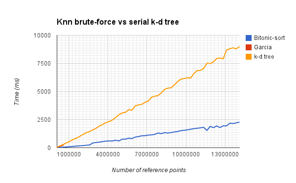
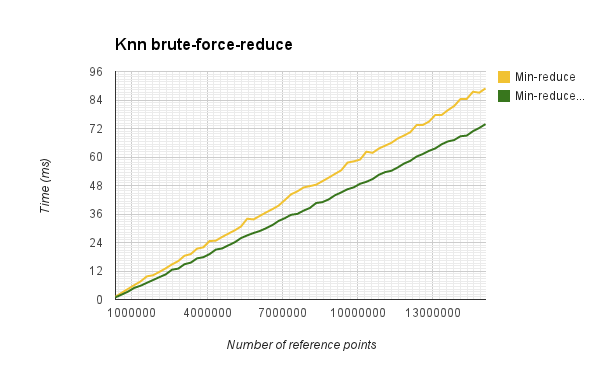
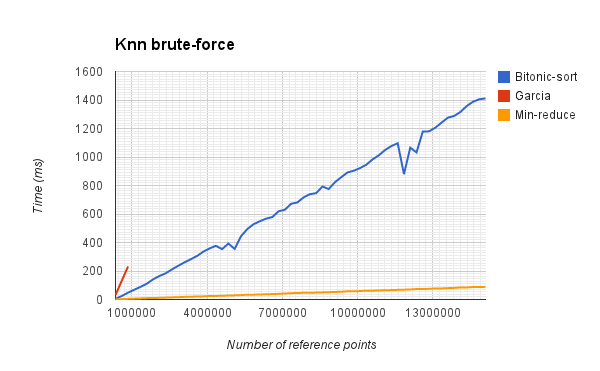
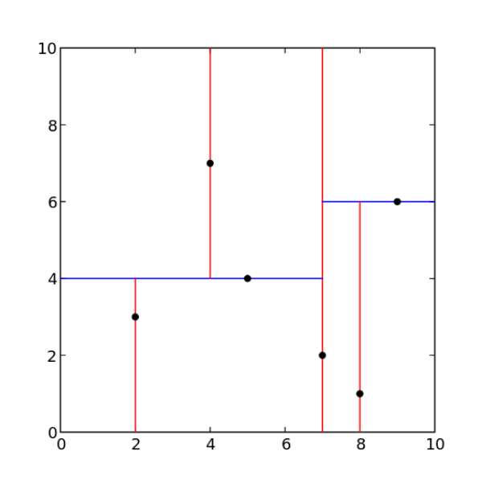
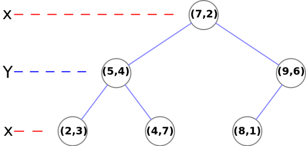
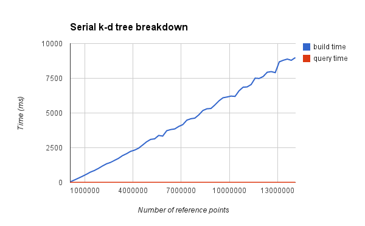

#The quest for a fast KNN search

This document is a summary of our most recent (7 February 2014) findings, in the quest for a fast kNN search algorithm.

Our initial investigation led us to believe that a serial implementation could be as fast as the parallel brute-force solution, for point clouds with fewer than 1 000 000 points, given that both algorithms start with an unordered set of points. Reimplementing the brute-force algorithm with bitonic sort, and optimizing for three dimensions, has shown us that this initial belief was unsupported, and currently the brute force algorithm is faster when starting from a unorganized set of points. When considering repeated querying of the same point cloud, the k-d tree based solution pulls ahead, as most of its running time is spent building the k-d tree for querying. If building the k-d tree could be parallelized this could change. although documented in literature, such an parallelization is still elusive.

In order to make the document more readable, we have included short descriptions of the algorithms used, a short reference to theoretical time complexity. We then go on to list our current results, problematic areas and possible improvements.

The following papers, available in the resources folder, forms the literary basis for our current work.

Related to the brute force approach:
* _Improving the k-Nearest Neighbour Algorithm with CUDA - Graham Nolan_
* _Fast k Nearest Neighbor Search using GPU - Garcia et al._
* _K-nearest neighbor search: fast gpu-based implementations and application to high-dimensional feature matching - Garcia et al._

Related to the k-d tree based approach:
* _Real-Time KD-Tree Construction on Graphics Hardware - Kun Zhou et al._

# Brute force based effort

## Garcia's base algorithm

Garcia's algorithm is based on a naive brute-force approach. It consists if two steps:

1. Calculate the distance between all reference points and query points.
2. Sort the distances and pick the k smallest distances.

Garcias implementation supports any number of dimensions, reference points and query points (or up to ~65000, number of blocks in the GPU). Due to this feature the algorithm use a lot of extra computation power when only one query point and a small dimensions is selected.

#### Time complexity

Steps:

1. O(n). Every reference point must be evaluated once. Since all calculations are independent, we have a large potential for parallelizing.
2. Insertion sort: O(n^2).

## Our reimplementation

### Bitonic-sort

Graham Nolan discusses the possibility of improving Garcia's algorithm by reimplementing step two with a bitonic sort. His source code has not been available to us, but he states that the run-time improvements was significant. As well as choosing bitonic sort for the sorting stage of our algorithm, our implementation supports up to 15 000 000 points before memory errors occur, and we have limited the number of dimensions to three.

#### Time complexity

Steps:

1. O(n).
2. Bitonic sort: worst case = O(n*log²(n)), average time ( parallel) = O(log²(n)).

#### Results

Testing the different algorithms for a range of point cloud sizes and a fixed value for k, gave the following results.

We see that our reimplementation of the brute-force algorithm performs well overall, notably improving on Garcia's implementation (only visible as a short line in the beginning of the graph, due to the restricted number of points it is able to compute). Still more speed is desired before good interactive usage can be achieved.

Test with n =8 388 608:

* Memory transfer:  21.1 ms.
* Calculate all distances: 2.5 ms.
* Bitonic sort:  176 ms.
* Total: 200 ms.

### Min-Reduce

An other possibility to improve step 2 is to use a reduce operation to get the smallest distances. This can be done k times to get the k smallest values.

#### Time complexity

Steps:

1. O(n).
2. Min-reduce: k* log²(n)).

#### Memory optimalisation

We have done some memory optimization based on a [presentation](https://github.com/hgranlund/tsi-gpgpu/blob/master/resources/kNN/reduction.pdf) from Nvidia.

The optimizations include:

* Shared memory utilization.
* Sequential Addressing.
* Complete for-loop Unrolling.

#### Results

Test results of n = 8 388 608 with no memory optimization:

*  Memory transfer:  21.1 ms.
*  Calculate all distances: 2.5 ms
*  One min-reduce step : 4.8 ms.
*  Total time: (23.7 + k*4.8) ms.

Test results of n = 8 388 608 with memory optimization:

*  Memory transfer:  21.1 ms.
*  Calculate all distances: 2.5 ms
*  One min-reduce step : 1.7 ms.
*  Total time: (23.7 + k*1.7) ms.

fig: Brute-force - k = 10

### Possible improvements

* Memory improvements. Use shared memory and texture memory.
* Modify bitonic sort, so do not need to sort all points. We can split the distance array to fit into the GPU blocks, move the smallest values in each block, then sort the moved values. ~O((n/b)* b*log²(b)) subsetof O(n/b), b = Number of threads in each block, n= number of reference points
* Replace bitonic sort with min reduce. O(k*log²(n)).

# k-d trees

A k-d tree can be thought of as a binary search tree for graphical data. A few different variations exist, but we will focus our explanation around a 2D example, storing point data in all nodes. The plane is split into two sub-planes along one of the axis (in our example the y-axis) and all the nodes are sorted as to whether they belong to the left or right of this split. To determine the left and right child of the root node, the two sub-planes are again split at an arbitrary point, this time cycling to the next axis (in our example the x-axis) and the

In order to build a k-d tree for 3D space, you simply cycle through the three dimensions, instead of two.

Given the previous splits and selection of nodes, the resulting binary tree would be as shown in the illustration under. (All illustrations gratuitously borrowed from [Wikipedia](http://en.wikipedia.org/wiki/K-d_tree))

Given that the resulting binary tree is balanced, we get an average search time for the closest neighbor in O(log² n) time. For values of k << n, the same average search time can be achieved, with minimal changes to the algorithm, when searching for the k closest neighbors. It is known from literature that balancing the tree can be achieved by always splitting on the meridian node. Building a k-d tree in this manner takes O(kn log² n) time.

Interested readers is encouraged to look at the paper "Multidimensional binary search trees used for associative searching" by Jon Louis Bentley, where kd-trees first was described. 

## The serial base algorithm

1. Build a balanced k-d tree from the point cloud.
2. Query the tree for different sets of neighbors.

#### Time complexity

Steps:

1. O(n log² n). Achieving this speed is dependent on an efficient algorithm for finding the meridian.
2. Approximately O(log² n), but dependent on size of k.

#### Results

As expected, almost all the time is spent building the tree. Querying for the closest neighbor in the largest tree took less than 0.0015 ms, but 9 seconds is a long time to wait for the tree to build.

The paper _Real-Time KD-Tree Construction on Graphics Hardware - Kun Zhou et al._ offers interesting, although slightly complex, ideas to an efficient parallelization of k-d tree construction. I order to save time, a good amount of time was spent searching for, and trying out, different open source implementations based on this paper. This search was unsuccessful. All the implementations we managed to find was problematic due to lack of updates, often not updated since 2011, and still running on CUDA 4.1, lack of documentation, lack of generalization or dubious source code.

A more uplifting find was several references to _Real-Time KD-Tree Construction on Graphics Hardware_ in material published by NVIDIA, regarding their proprietary systems for ray tracing. A graphics rendering technique often reliant on k-d trees, and indeed dependent on high performance.

## Parallel implementations

As we noted in the previous section, the kd-tree build process is by far the most expensive operation, and we would save a lot of time by managing to parallelize this operation. In order to do this, we have to look a bit closer at the different steps of the kd-tree build algorithm.

Steps:

1. Find the median of the points along a specified axis. This median point becomes the value of the current node.
2. Sort all points with lower values than the median to the left of the median, and all the points with higher values than the median to the right.
3. Perform this algorithm recursively on the left and right set of nodes.

Several strategies can be used to parallelize this code. We can perform the recursive calls as a increasing number of different independent processes. We can also use a parallel algorithm for finding the median in each recursive call. Both strategies can be used in conjunction with each other. The parallel algorithm for finding the median can be used to speed up the early iterations, where we do not have the possibility of calculating several sub-trees in parallel, as well as speeding up the calculation on lather calculations, by utilizing the large number of concurrent threads available in each parallel process.

Different parallel algorithms for finding the median was considered. First we tried to reuse the implementation of bitonic sort. given a sorted list, you can find the median directly, by simply looking at the midmost element of the array. This strategy was quickly abandoned, as re-purposing the bitonic algorithm for such an task proved difficult. Sorting a list, in order to find the median, is also inherently a inefficient strategy, since O(n) algorithms for finding the median exist, compared to the O(n log(n)) time required by sorting. Therefor radix select was chosen as our strategy for finding the median.

__Simen write something about radix select__

### Results

__Here we presents graphs of the parallel implementation of kd-tree building__

### Further work

* Look at memory optimization with CUDA.
* Implement parallel search, where the different queries are performed in parallel.
* More to be included.
