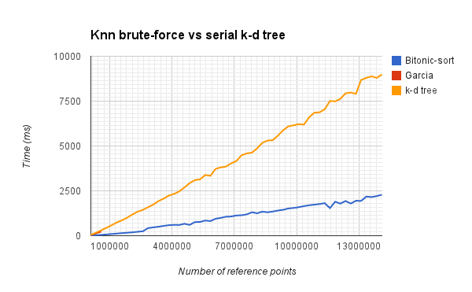
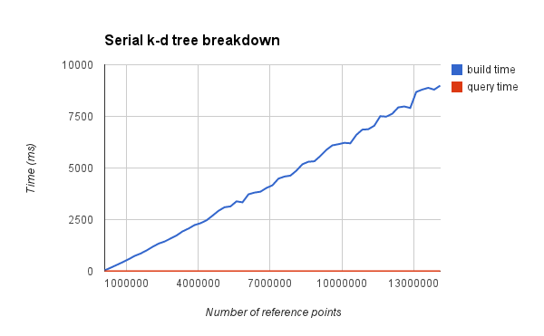

The quest for a fast KNN search
===============================

This document is a summary of our most recent (7 February 2014) findings, in the quest for a fast kNN search algorithm. 

Our initial investigation led us to believe that a serial implementation could be as fast as the parallel brute-force solution, for point clouds with fewer than 1 000 000 points, given that both algorithms start with an unordered set of points. Reimplementing the brute-force algorithm with bitonic sort, and optimizing for three dimensions, has shown us that this initial belief was unsupported, and currently the brute force algorithm is faster when starting from a unorganized set of points. When considering repeated querying of the same point cloud, the k-d tree based solution pulls ahead, as most of its running time is spent building the k-d tree for querying. If building the k-d tree could be parallelized this could change. although documented in literature, such an parallelization is still elusive.

In order to make the document more readable, we have included short descriptions of the algorithms used, a short reference to theoretical time complexity. We then go on to list our current results, problematic areas and possible improvements.

The following papers, available in the resources folder, forms the literary basis for our current work.

Related to the brute force approach:
* _Improving the k-Nearest Neighbour Algorithm with CUDA - Graham Nolan_
* _Fast k Nearest Neighbor Search using GPU - Garcia et al._
* _K-nearest neighbor search: fast gpu-based implementations and application to high-dimensional feature matching - Garcia et al._

Related to the k-d tree based approach:
* _Real-Time KD-Tree Construction on Graphics Hardware - Kun Zhou et al._

Brute force based effort
------------------------

### Garcia

_Improving the k-Nearest Neighbour Algorithm with CUDA - Graham Nolan_
_Fast k Nearest Neighbor Search using GPU - Garcia et al._
_K-nearest neighbor search: fast gpu-based implementations and application to high-dimensional feature matching - Garcia et al._

Garcia's algorithm is based on a naive brute-force approach. It consists if two steps:

1. Calculate the distance between all reference points and query points.
2. Sort the distances and pick the k smallest distances.

Garcias algorithm supports any number of dimensions, reference points and query points (or up to ~65000, number of blocks in the GPU). Due to this feature the algorithm use a lot of extra computation power when only one query point and a small dimensions is selected.

#### Time complexity

Steps:

1. O(n). Every reference point must be evaluated once. Huge positional for parallelizing.
2. Insertion sort: O(n^2).

### Graham Nolan

He is talking about improving Garcia's algorithm by reimplementing step two with a bitonic sort.

We have not been able to get the source code, but he said the improvement was significant.

#### Time complexity

Steps:

1. O(n).
2. Bitonic sort: worst case = O(n*log²(n)), average time ( parallel) = O(log²(n)).

### Our reimplementation.

This algorithm uses the same steps as Garcia and Nolan, but they have been reimplemented to support more points. (Got memory error over 15 000 000 points).

#### Time complexity

Steps:

1. O(n).
2. Bitonic sort: worst case = O(n*log²(n)), average time ( parallel) = O(log²(n)).

#### Possible improvements

* Memory improvements. Use shared memory and texture memory.
* Modify bitonic sort, so do not need to sort all the points. We can split the distance array to fit into the GPU blocks, move the smallest values in each block, then sort the moved values. ~O((n/b)* b*log²(b)) subsetof O(n/b), b = Number of threads in each block(constant), n= number of reference points
* Replace bitonic sort with min reduce. O(k*log²(n)).

* General overview of the method.
* Reference to literature.
* Some reasoning about speed.
* Some results.
* Bottlenecks.
* Some ideas of what can be improved.

KD-tree based effort
--------------------

_Real-Time KD-Tree Construction on Graphics Hardware - Kun Zhou et al._

* General overview of the method.
* Reference to literature.
* Some reasoning about speed.
* Some results.
* Bottlenecks.
* Some ideas of what can be improved.

Final thoughts
--------------

* Access to [CUKNN: A parallel implementation of K-nearest neighbor on CUDA-enabled GPU](http://ieeexplore.ieee.org/xpl/articleDetails.jsp?arnumber=5382329) paper.